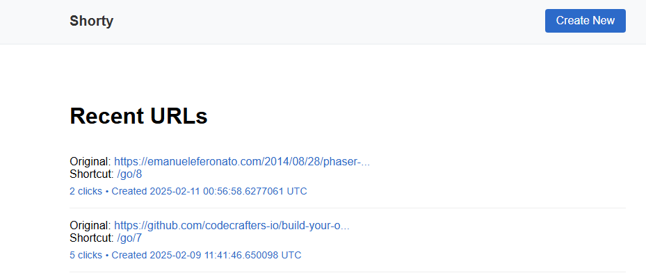

# shorty

A simple URL shortening service built with Haskell.



## Usage and building

```
stack build
stack run
```

Server will be available at `http://localhost:3000`

Database automatically created in `shorty.db`

## Testing

```
stack test
```

## Tech stack

- Haskell
  - The language, of course
- Scotty
  - Web framework
- SQLite
  - Database
- Persistent
  - Database ORM
- Lucid
  - HTML builder